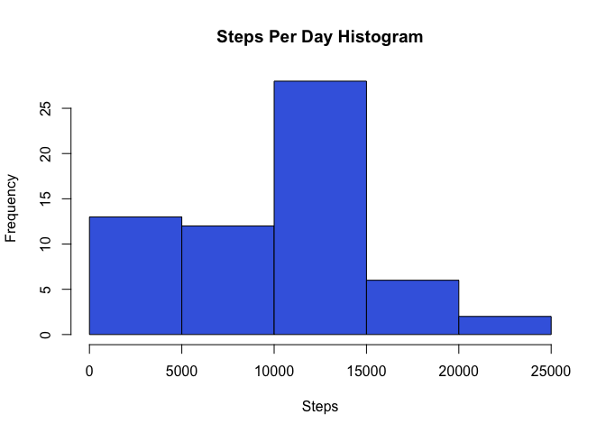
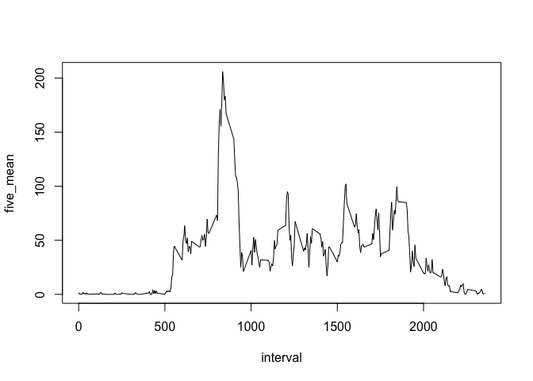
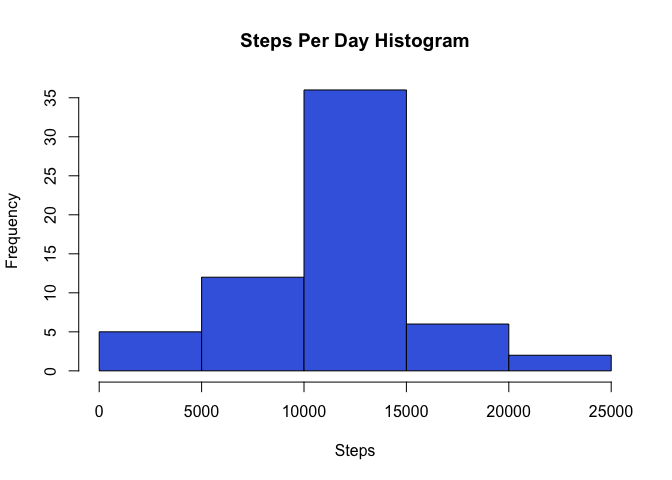
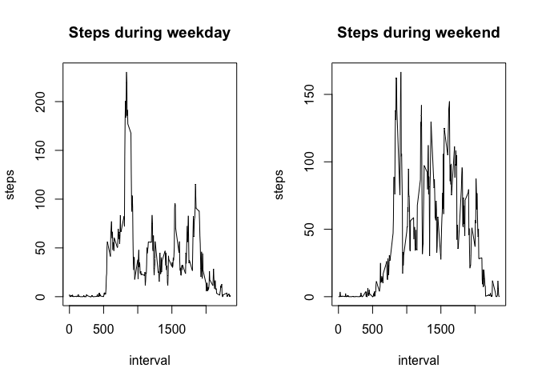

## Loading and preprocessing the data

```r
library(dplyr)
library(xtable)
activity = read.csv("activity.csv")
activity["Day"] = weekdays(as.Date(activity[,2], "%Y-%m-%d"))
```


## What is mean total number of steps taken per day?


```r
total_steps_per_day = activity %>% group_by(date) %>% summarize(steps = sum(steps, na.rm = TRUE))
hist(total_steps_per_day$steps, main = "Steps Per Day Histogram", xlab = "Steps", col = "royal blue")
```

<!-- -->


```r
summary(total_steps_per_day)
```

```
##          date        steps      
##  2012-10-01: 1   Min.   :    0  
##  2012-10-02: 1   1st Qu.: 6778  
##  2012-10-03: 1   Median :10395  
##  2012-10-04: 1   Mean   : 9354  
##  2012-10-05: 1   3rd Qu.:12811  
##  2012-10-06: 1   Max.   :21194  
##  (Other)   :55
```
We can see that the overall mean and median are given for our data in the steps column.  
**Median: 10,395**  
**Mean: 9,354**


## What is the average daily activity pattern?

```r
five_min_average = activity %>% group_by(interval) %>% summarize(five_mean = mean(steps, na.rm = TRUE))
with(five_min_average, plot(interval, five_mean, type ="l"))
```

<!-- -->


```r
five_min_average[five_min_average$five_mean == max(five_min_average[,2]),]
```

```
## # A tibble: 1 x 2
##   interval five_mean
##      <int>     <dbl>
## 1      835      206.
```
Interval 835 had the highest average with 206 steps. 


## Imputing missing values


```r
summary(activity)
```

```
##      steps                date          interval          Day           
##  Min.   :  0.00   2012-10-01:  288   Min.   :   0.0   Length:17568      
##  1st Qu.:  0.00   2012-10-02:  288   1st Qu.: 588.8   Class :character  
##  Median :  0.00   2012-10-03:  288   Median :1177.5   Mode  :character  
##  Mean   : 37.38   2012-10-04:  288   Mean   :1177.5                     
##  3rd Qu.: 12.00   2012-10-05:  288   3rd Qu.:1766.2                     
##  Max.   :806.00   2012-10-06:  288   Max.   :2355.0                     
##  NA's   :2304     (Other)   :15840
```
We can see there is a total of 2304 NA's in the data set. 
Now we will fill in these NA's with their equivalent 5-minute interval average.


```r
completed_activity = activity
i = 0
while(i < dim(activity)[1]){
  i = i + 1
  if(is.na(completed_activity[i,1]) == TRUE){
    completed_activity[i,1] = five_min_average[five_min_average$interval == completed_activity[i,3], 2]
  }
}

print(head(completed_activity))
```

```
##       steps       date interval    Day
## 1 1.7169811 2012-10-01        0 Monday
## 2 0.3396226 2012-10-01        5 Monday
## 3 0.1320755 2012-10-01       10 Monday
## 4 0.1509434 2012-10-01       15 Monday
## 5 0.0754717 2012-10-01       20 Monday
## 6 2.0943396 2012-10-01       25 Monday
```

And now a new histogram with the updated data:


```r
mean_steps_per_day_completed = completed_activity %>% group_by(date) %>% summarize(steps = sum(steps, na.rm = TRUE))
hist(mean_steps_per_day_completed$steps, main = "Steps Per Day Histogram", xlab = "Steps", col = "royal blue")
```

<!-- -->


## Are there differences in activity patterns between weekdays and weekends?

```r
week_class = factor(c("Weekend", "Weekday"))

i = 0
while(i < dim(completed_activity)[1]){
  i = i + 1
  if(completed_activity$Day[i] == "Saturday" || completed_activity$Day[i] == "Sunday"){
    completed_activity$week_class[i] =  as.character(week_class[1])
  }
  else {completed_activity$week_class[i] =  as.character(week_class[2])}
}

completed_activity$week_class = as.factor(completed_activity$week_class)
intervals_weekday = completed_activity[completed_activity$week_class == "Weekday",] %>% group_by(interval) %>% summarize(steps = mean(steps, na.rm = TRUE))
intervals_weekend = completed_activity[completed_activity$week_class == "Weekend",] %>% group_by(interval) %>% summarize(steps = mean(steps, na.rm = TRUE))
```
Now that we have mean intervals by weekend and weekday we can plot it. 


```r
par(mfrow=c(1,2))
with(intervals_weekday, plot(interval, steps ,type="l", main = "Steps during weekday"))
with(intervals_weekend, plot(interval, steps ,type="l", main = "Steps during weekend"))
```

<!-- -->

We can see that weekends have a much higher and constant step count per interval. 


